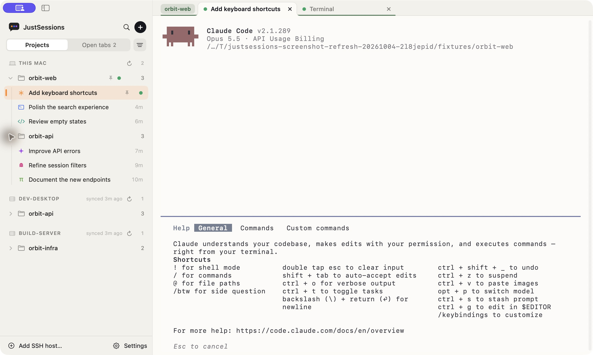
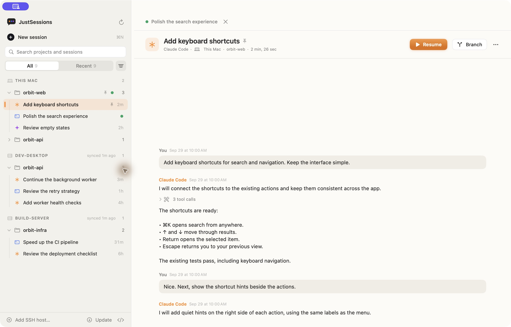
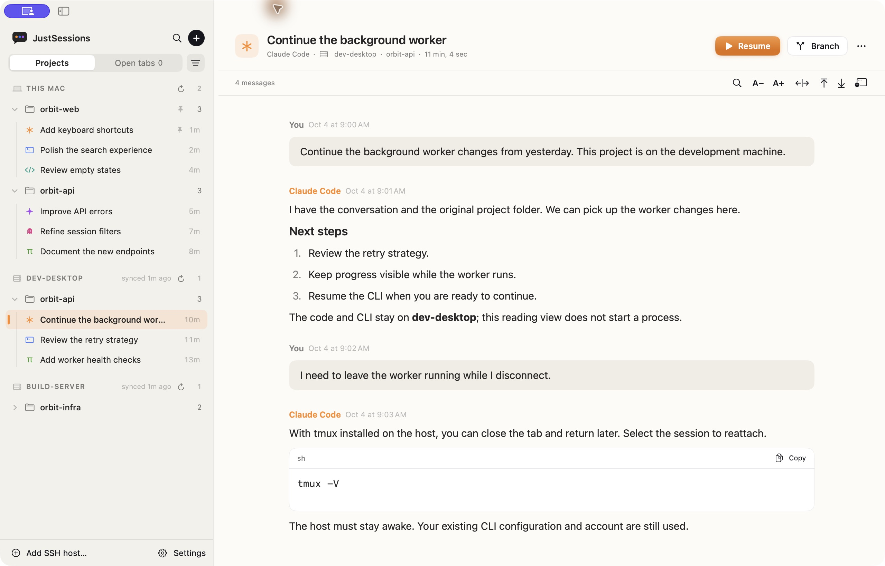
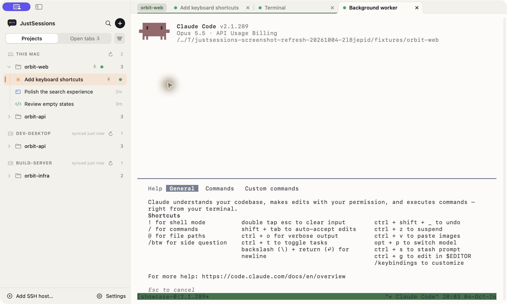
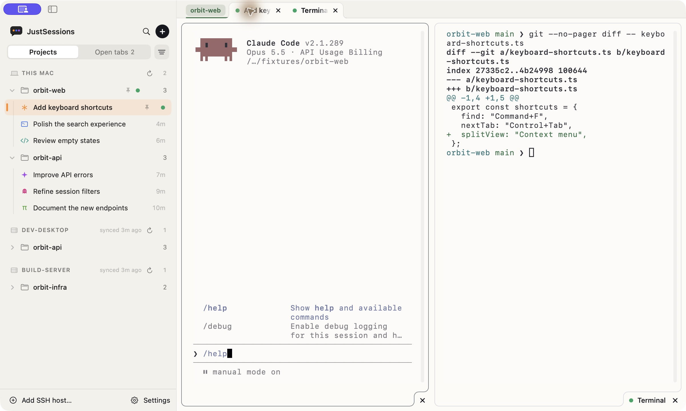

  

<h1 align="center">JustSessions</h1>

  <b>Nothing extra. Just sessions.</b> 
  Multiple agents, all your sessions in one place. Your familiar command line, with native tabs.

  

  
  
  
  
  

For people who prefer the command line. JustSessions adds a native Mac workspace around your existing CLIs. Keep their terminal interface, configuration, and provider authentication.

[Website](https://yangzichao.github.io/JustSessions/) · [Guide](https://yangzichao.github.io/JustSessions/guide.html) · [Compare](https://yangzichao.github.io/JustSessions/compare.html) · [Download](#download) · [Supported CLIs](#supported-clis) · [Documentation](docs/README.md)

## Multiple agents. One project.

**Claude Code · Codex CLI · Antigravity CLI · Kiro CLI · OpenCode · Pi**

- Group sessions from different agents under the same project.
- Search projects and sessions, down to the text of their messages; pin and rename favorites.
- Start or resume a session in its original CLI and project folder.

## New. Resume. Delete.

- Start with any installed agent.
- Read a conversation, then resume in its original CLI.
- Delete saved sessions from the app.

[Reading controls](docs/guides/session-management.md#preview-before-you-resume) cover text size, images, history paging, and search limits.

## Work on any host.

- Local and SSH projects in one sidebar.
- Browse history and resume remotely.
- Your code and CLI stay on the remote machine.

Add a `~/.ssh/config` alias or `user@hostname` with passwordless SSH, `rsync`, and the CLI installed. Session history is cached on your Mac. [SSH setup](docs/guides/session-management.md#ssh-hosts).

## Close a tab. Keep the work.

- Close the tab → choose [**Keep running**](docs/images/tmux-close-choice.jpg).
- Quit the app. The CLI stays alive in tmux.
- Click the session to reattach to the same process.

The packaged app includes tmux for this Mac. Install tmux on each SSH host to survive disconnects there. Keep the machine awake. Plain shell tabs do not use tmux. [Terminal persistence](docs/guides/session-storage.md#terminal-persistence).

## Tabs like Chrome. Split view.

- Create, switch, and group tabs by project.
- Use **Open tabs** for a vertical list of your terminals.
- Automatically reopen tabs on launch.
- Keep an agent and shell side by side; drag the divider to resize.

Tab recovery is controlled in **Settings → General**; split layouts reopen as separate tabs. [Tabs and split view](docs/guides/session-management.md#resume-branch-and-start-sessions).

## Lightweight by design

- **Native SwiftUI + SwiftTerm.** A Mac app with an AppKit terminal.
- **No import or new account.** Reads the history your CLIs already create.
- **No conversation uploads.** JustSessions reads existing CLI history; your CLIs still communicate with their providers.
- **Free and open source.** MIT licensed; your CLI provider’s charges still apply.

Choose system, English, or Chinese for the interface. Set app themes, terminal fonts and colors, or import iTerm2 colors. Local Claude Code and Codex sessions can notify when a turn finishes or needs your input. [Settings and notifications](docs/guides/session-management.md).

## Download

**macOS 14+ · Apple Silicon · A supported CLI installed and signed in**

1. Download **[JustSessions.dmg](https://github.com/yangzichao/JustSessions/releases/latest/download/JustSessions.dmg)**, Developer ID signed and notarized by Apple.
2. Drag **JustSessions** into **Applications** and launch it.
3. Choose a session in **Projects**, then double-click or press **Resume**.

Updates arrive through Sparkle; check manually in **Settings → General**. [Getting started](docs/guides/getting-started.md).

## Supported CLIs

| Capability | Claude Code | OpenAI Codex CLI | Google Antigravity CLI | Kiro CLI | OpenCode | Pi |
| --- | --- | --- | --- | --- | --- | --- |
| Browse, search, and resume local sessions | Yes | Yes | Yes | Yes | Yes | Yes |
| Read a conversation preview | Yes | Yes | Yes | Yes | Yes | Yes |
| Branch a conversation from the app | Yes | Yes | Use `/fork` inside the CLI | Use `/rewind` inside the CLI | Yes | Yes |
| Browse and manage sessions over SSH | Yes | Yes | Yes | Yes | Yes | Yes |
| Delete sessions from the app | Yes | Yes | Yes | Yes | Yes | Yes |

New session menus offer only installed CLIs. See the [storage guide](docs/guides/session-storage.md#session-locations) for discovery paths and deletion requirements.

Search matches project names and paths, session titles, session IDs, and message text: what you wrote, the CLI's replies, and tool call summaries. **Branch** forks a conversation; it does not create a Git branch.

## Documentation and development

Build locally with `make`; the app is written to `dist/JustSessions.app`. Use `make dev` to build and open it, or `make help` for other commands.

- [Getting started](docs/guides/getting-started.md)
- [Session management](docs/guides/session-management.md): tabs, split view, shortcuts, SSH, notifications, and settings.
- [Session storage and privacy](docs/guides/session-storage.md)
- [Build and release](docs/development/build-and-release.md) · [Source layout](docs/development/source-layout.md)
- [Website development and traffic](docs/development/website.md) · [Counting update checks](docs/development/update-checks.md)
- [All documentation](docs/README.md) · [Release notes](https://yangzichao.github.io/JustSessions/release-notes.html)

See [Contributing](CONTRIBUTING.md) for setup and pull requests. Run `make verify` on the final commit and include the results in the PR template. Please follow the [Code of Conduct](CODE_OF_CONDUCT.md).

[Security reports](SECURITY.md) · [Accessibility](ACCESSIBILITY.md) · [Report a bug or suggest a feature](https://github.com/yangzichao/JustSessions/issues/new/choose)

For in-app help, open **Settings → Help**. Send feedback or report an issue from **Settings → General**, or the [website Guide](https://yangzichao.github.io/JustSessions/guide.html#feedback).

## License

[MIT](LICENSE). The embedded terminal uses [SwiftTerm](https://github.com/migueldeicaza/SwiftTerm) under its MIT license.
